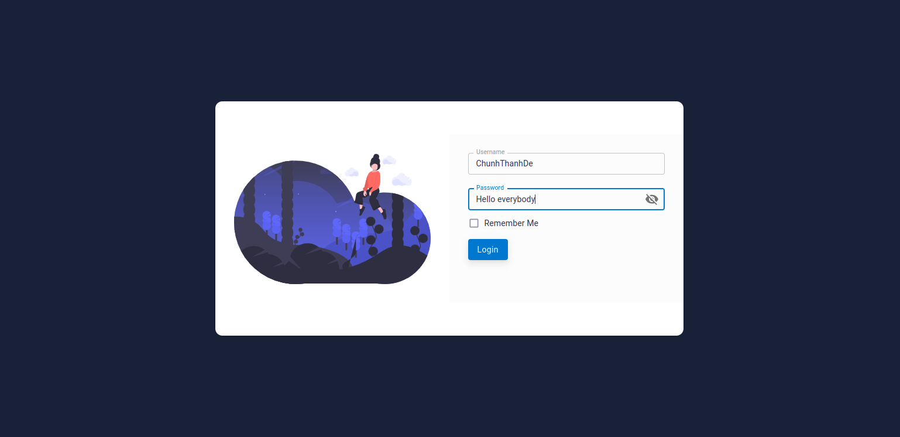
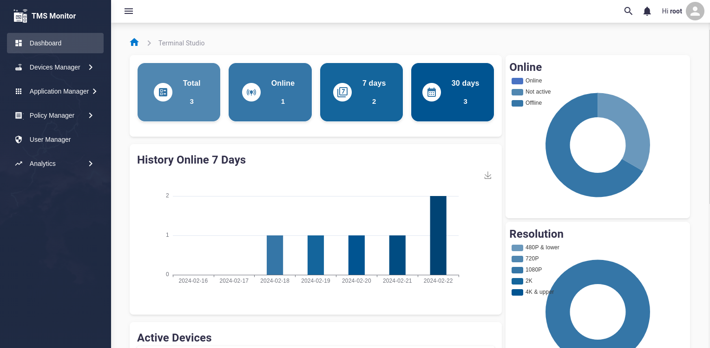
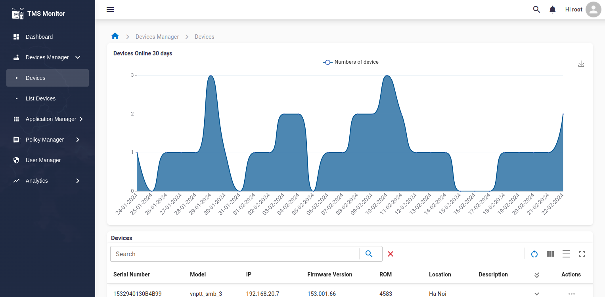
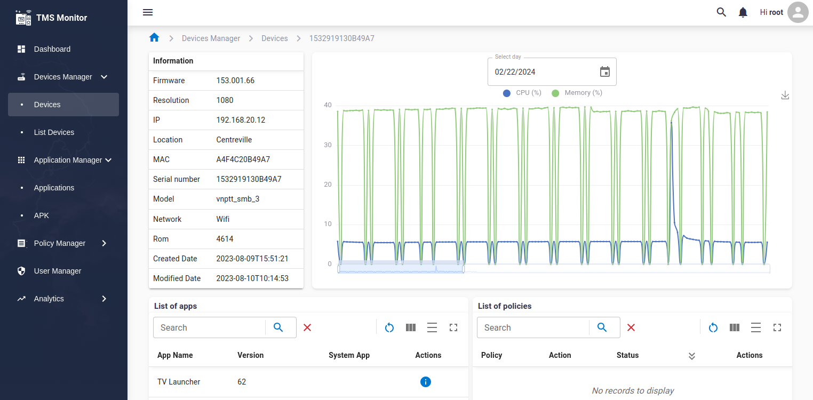
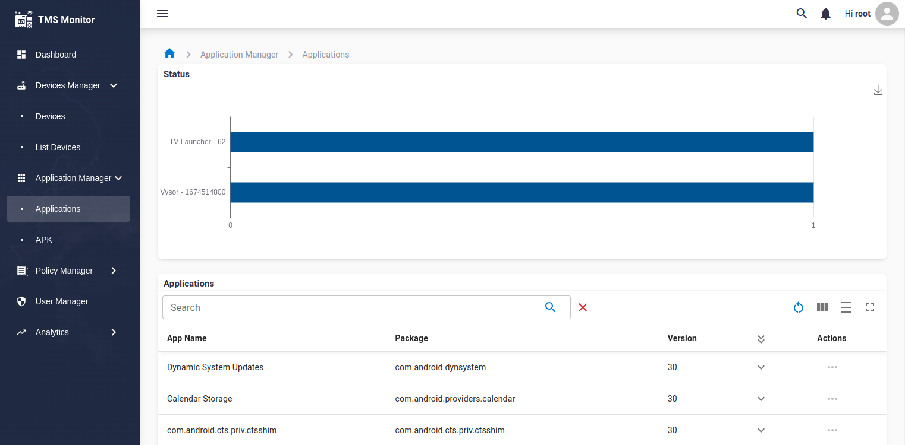
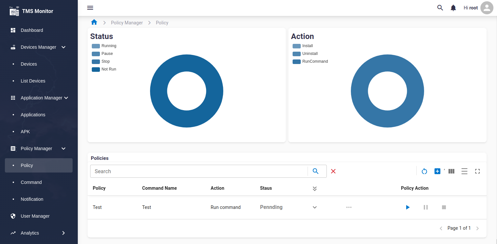
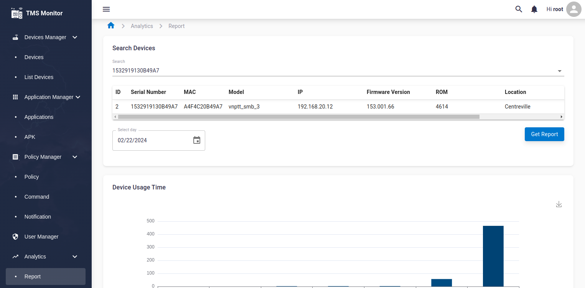
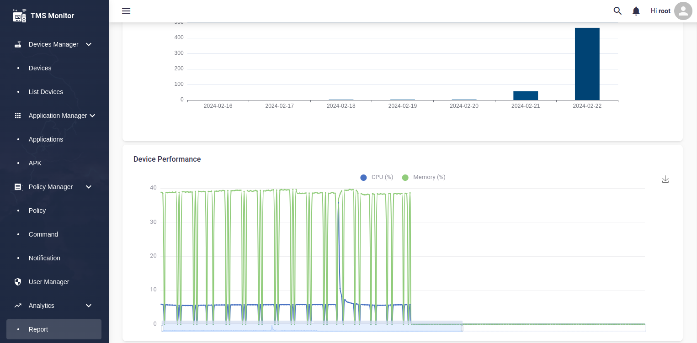
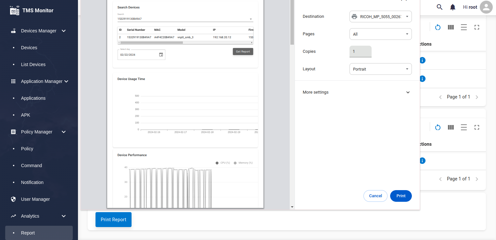
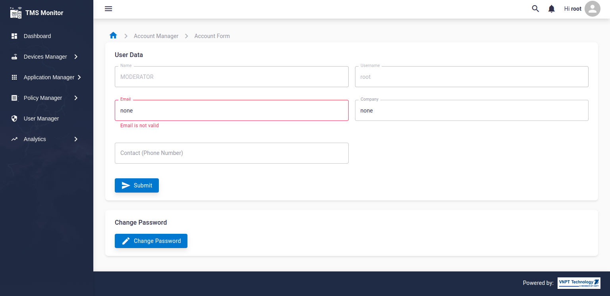

# TMS - Terminal Management System for AOSP and ATV Set-top Box product lines

##### The set-top box terminal management system is the University Graduation Project of student Chung Nguyen Thanh - School of Electrical and Electronics Engineering of Hanoi University of Science and Technology.

##### This source is the web client interface for Smart Box device managers of the TMS. For security reasons, I cannot publish the application source code of this system. The following link is the Back-end source code of the project: https://github.com/ChunhThanhDe/tms-springboot

###### contact for work, mail: chunhthanhde.dev@gmail.com

  
  
  

## Induction

Previously, the Set-top box (STB) was known as a device that acted as an intermediary between the signal source and the TV. Its function was to decode television signals and convert them into audio and visual content displayed on the TV screen.

Today, the STB is also known as a Smart Box, which can transform a regular TV into a Smart TV with various entertainment features. These features include television services, movie streaming, gaming, web browsing, and access to social networks (karaoke, online learning, etc.). Additionally, the Smart Box can integrate with other Internet of Things (IoT) devices to create a complete home ecosystem.

For current SMB device providers, deploying, operating, managing, and troubleshooting the devices already in use on the market with millions of products is a resource-intensive task. Resources, both human and technical, are required here.

A large-scale system without a technical management system would require a significant number of technical support personnel while also investing in equipment and training programs for the workforce. However, even with these measures, carrying out tasks through multiple intermediate steps may not achieve maximum efficiency. Therefore, SMB device providers need a comprehensive management system capable of handling most user support tasks through Over-the-Air (OTA) updates. Additionally, the system should collect device information and user device usage data. With this information, the management team can generate reports and statistics to evaluate the performance, efficiency, and quality of the current product, as well as consumer habits. Based on these insights, software updates or hardware solutions can be implemented in the future.

  

    
  

<strong>System Model</strong>

Using the TMS management system will address the aforementioned requirements automatically, quickly, and accurately. While there are existing TMS systems in the market, they have not been widely adopted for SMB products or specific industries. Due to the aforementioned challenges and my interest in SMB technology, I have chosen this topic for my graduation project, with the aim of building an efficient and user-friendly system.

## Features

The TMS includes the following features:

- User management (Manage accounts allowed to access the system)
- Smart box device management (Device parameters, location, usage time,...)
- Application Management (Manage system applications and user applications)
- Monitor and track device operating history (Monitor real-time device uptime, application usage history, performance parameters)
- Manage Operational Policies (Create and deploy operational policies for devices including reboot, automatically download and install applications, uninstall applications, display notifications, warnings, advertisements, deploy support after-sales support,...)

## ScreenShots

|                   _Screen Login_                    |
| :-------------------------------------------------: |
|  |

|                        _Screen Home Dashboard_                        |
| :-------------------------------------------------------------------: |
|  |

|                        _Screen Device Manager_                        |
| :-------------------------------------------------------------------: |
|  |

|                       _Screen Device Detail_                        |
| :-----------------------------------------------------------------: |
|  |

  
 Show more 

|                          _Screen Application Manager_                           |
| :-----------------------------------------------------------------------------: |
|  |

|                        _Screen Policy Manager_                        |
| :-------------------------------------------------------------------: |
|  |

|                 _Screen Analytics Function 1_                 |
| :-----------------------------------------------------------: |
|  |

|                 _Screen Analytics Function 2_                 |
| :-----------------------------------------------------------: |
|  |

|                       _Screen Print Report_                       |
| :---------------------------------------------------------------: |
|  |

|                       _Screen User Manager_                       |
| :---------------------------------------------------------------: |
|  |

|                        _Screen Profile Manager_                         |
| :---------------------------------------------------------------------: |
|  |

## Getting started

In the project directory, you can run the following scripts:

### `npm run build`

Builds the app for production to the `build` folder.
It correctly bundles React in production mode and optimizes the build for the best performance.
The build is minified and the filenames include the hashes.
Your app is ready to be deployed!

### `npm start`

Runs the app in development mode.
Open [http://localhost:3000](http://localhost:3000) to view it in the browser.
The page will reload if you make edits, and you will also see any lint errors in the console.

## Download

#### This Front-end web is developed from Matx - Free and open-source React Material UI Admin Dashboard Template

#### [Live Preview](https://matx-react-free.netlify.app/) - [GitHub MatX](https://github.com/uilibrary/matx-react)
